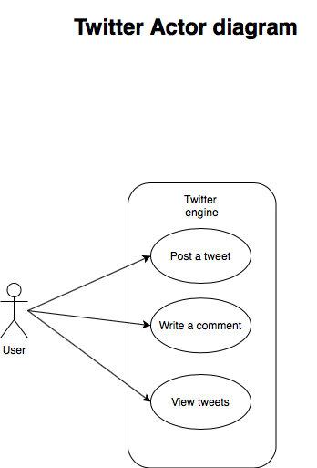
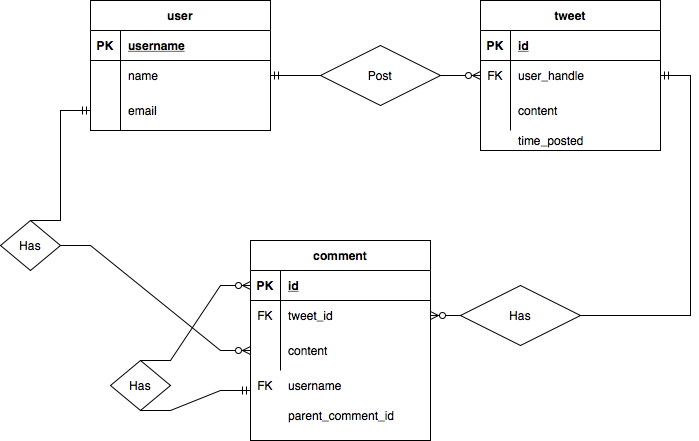
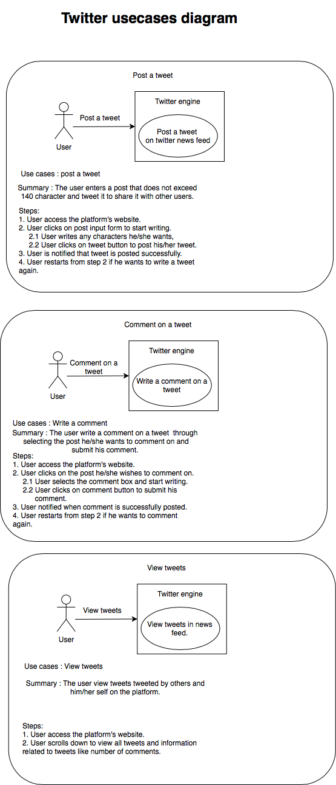

# twitter

This project is part of a technical assesment for a backend developer position. 

## Setting up developement environment
 To run this project, you have to follow the below steps:
 - First, clone the project using git clone "https://github.com/12mohaned/twitter".
 - Navigate to the project using cmd.
 - Install the required packages and libraries mentioned in the **Dependencies** section. 
 - After installing the dependencies, navigate using cmd to app folder then run **Flask run** to start the server
 
## Dependencies
- Python >= 3.9.
- Postgres12 .
- Run "pip install -r requirements.txt"

## Code guidelines 
- The code in this project follows PEP8 standard. 
- The commenting guidelines of the project adapts "Coding without comments" [philsophy](https://blog.codinghorror.com/coding-without-comments/), but since python is 
  a dynamic language, functions were commented to show paramters type for the purpose of clarifying any 
  ambiguity about paramters data type for fellow developers. 
- Please bear in mind that the UI is not complete, so some of the API's will not fully functional, since they depend on values from forms in UI.
## Diagrams
### Actor diagram

##### The below diagram illustrates the system actors and their interaction with system functions.

### Twitter's ERD

##### The below diagram illustrates the database tables and their relations with one another.

### Twitter's usecases

##### The below diagram illustrates twitter actors usecases and their analysis in depth.

