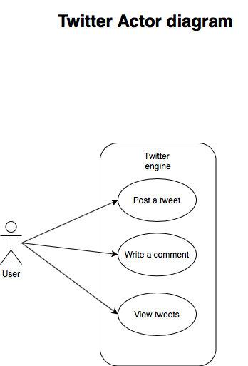
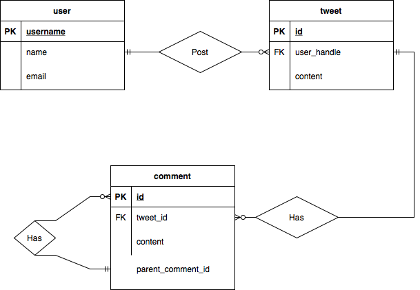
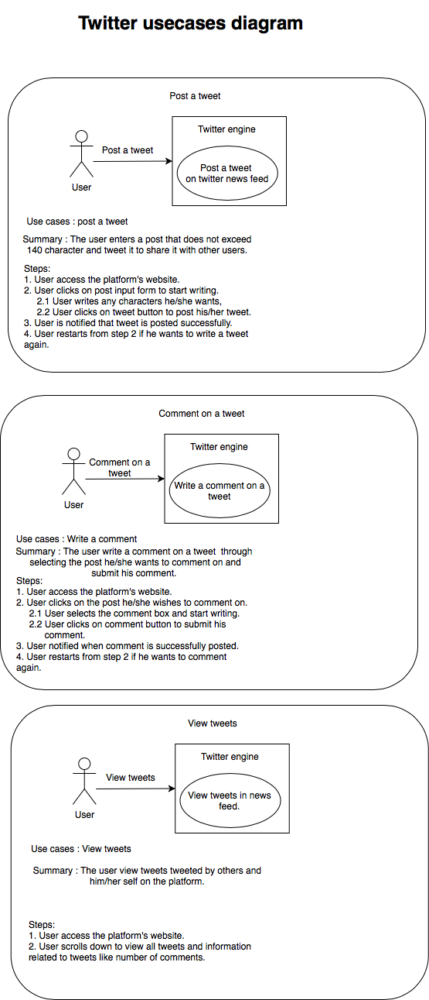

# twitter

This project is part of a technical assesment for a backend developer position. 

### Actor diagram

##### The below diagram illustrates the system actors and their interaction with system functions.

### Twitter's ERD

##### The below diagram illustrates the database tables and their relations with one another.

### Twitter's usecases

##### The below diagram illustrates twitter actors usecases and their analysis in depth.

